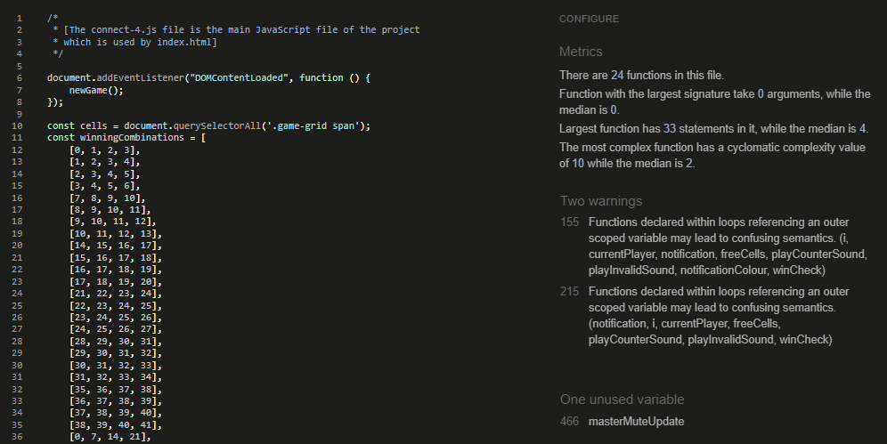
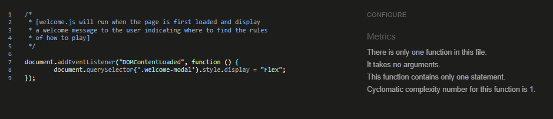

# Connect 4
Developer: Jamie King

[Connect 4](https://jkingportfolio.github.io/CI_PP2_Connect4/) website has been developed to provide users the chance to play the classic two player strategy game of Connect 4. The game consists of players taking turns to drop their counters into the game board with the aim of the game to have four of their own counters in a row horizontally, vertically or diagonally. 

## Table of Contents

1. [Project Goals](#project-goals)
    1. [User Goals](#user-goals)
    2. [Site Owner Goals](#site-owner-goals)
2. [User Experience](#user-experience)
    1. [Target Audience](#target-audience)
    2. [User Requirements and Expectations](#user-requirements-and-expectations)
    3. [User Stories](#user-stories)
    4. [Site Owner Stories](#site-owner-stories)
3. [Design](#design)
    1. [Design Choices](#design-choices)
    2. [Colour](#colour)
    3. [Fonts](#fonts)
    4. [Structure](#structure)
    5. [Wireframes](#wireframes)
    6. [Game Flowchart](#game-flowchart)
4. [Technologies Used](#technologies)
    1. [Coding Languages](#coding-languages)
    2. [Frameworks and Tools](#frameworks-and-tools)
5. [Features](#features)
6. [Testing](#testing)
    1. [HTML Valiadation](#html-validation)
    2. [CSS Validation](#css-validation)
    3. [JavaScript Validation](#javascript-validation)
    4. [Accessibility](#accessibility)
    5. [Performance](#performance)
    6. [Device Testing](#device-testing)
    7. [Browser Compatibility](#browser-compatibility)
    8. [Testing User Stories](#testing-user-stories)
7. [Bugs](#bugs)
8. [Deployment](#deployment)
    1. [EmailJS API](#emailjs-api)
9. [Credits](#credits)
10. [Acknowledgements](#acknowledgements)

## Project Goals

### User Goals

- A user would want to play a fun game of connect 4.
- A user would want to know the aim the game if this is my first time doing so.
- A user would want to what the controls of the game are.
- A user would want to have the option to play a computer opponent or with a friend (locally).
- A user would want to be able to check how many wins and losses they have had in their current session.

### Site Owner Goals

- As the site owner i wanted to create an enjoyable interactive game which was responsive over multiple devices.
- As the site owner i wanted to provide a fun user experience which would make users want to come back and play again. 
- As the site owner i wanted to allow my users to provide myself some feedback via a contact form
- As the site owner i wanted to have the ability to connect with my users via Github and Linkedin

## User Experience

### Target Audience

- Casual gamers.
- Adults who want to teach their children a new game.
- People from all walks of life hoping to pass time.

### User Requirements and Expectations

- A great game to pass time and have fun with friends
- Links and website functions to act as expected
- Notifications to indicate the current state of play
- Simple "to the point" content that a user can quickly digest
- An easy method to leave feedback on the game
- Accessibility for impaired users
- Responsiveness to allow play across devices of different screen sizes

### User stories

1. As a user, I want to understand the aim of the game.
2. As a user, I want to chose between playing a friend locally or a computer opponent.
3. As a user, I want to be notified as to whos turn it is.
4. As a user, I want to be notified if my move is invalid.
5. As a user, I want to be notified of who won the game.
6. As a user, I want to be able to see the total wins and draws in the current session.
7. As a user, I want to be able to turn on and off in game music and sounds.
8. As a user, I want to be able to provide feedback to the site owner and confirmation the feedback was sent.

### Site Owner Stories

9. As the site owner, I want users to be able to provide feedback via a contact form.
10. As the site owner, I want to connect with users via social networks.
11. As the site owner, I would not want the user to have to result in using the browser back button to navigate back to the site if a 404 error occurs.

## Design

### Design Choices

The game was designed with a clean simple design in mind. Using the original colours of the official game of a blue game board with red and yellow counters. This was done to induce a sense of nostalgia to older users and to make the game easily identifiable to younger users who may be new to the game. 

### Colours

The colour palette for the website is made up of 5 main colours:

- #FFFFFF (White)
- #000000 (Black)
- #FF0000 (Red)
- #FFFF00 (Yellow)
- #2B2EE2 (Blue)

The background gradient consists of 5 colours:

- #E0B5B5 
- #EABFB0
- #ECCBAD
- #D6DAAF
- #DAE9BA

When a button in New game or settings is active it is Green:

-#00C800

Two colours are used in the Winning Animation which flashes:

-#820000
-#828200

Two colours are used for the Stats button when active and inactive

-#CCCCCC
-#ACACAC

All colours contrast was tested using [EightShapes contrast grid](http://eightshapes.com/)

Colour Contrast Results

### Fonts

There were 2 fonts used in this project, as stated below:
- Alfa Slab One with a backup of cursive is the main font used throughout the website
- Dosis with a backup of sans-serif was used for the number identifiers on the counters

### Structure

The website's structure was carefully constructed whilst making it recognizable, user friendly and simple kept in mind. On arrival to the website the user will be presented with a notification that indicates click to play and a navigation bar which is uniform across all pages. The website is made of one main page, a 404 page and 4 modals:

- A homepage, which houses the game and comes with a nav bar which on click will display the desired modal
- A new game modal, where a user can select to play a human or computer opponent, a yes button to start new game or cancel button to return to the existing game currenlty in play if there is one.
- A Help modal, which displays the aim of the game, how to play and game controls.
- A Settings modal, where a user can turn on and off music and sounds individually
- A Contact modal, where a user can provide feedback to the site owner and also be provided with feedback as to if the message was sent successfully.
- A 404 page, which will allow the user to navigate back to the main site in the instance of a page 404 error.

### Wireframes

Balsamiq was used in the initial design stage to layout sketches of each page and its design intent

Index

Welcome Modal

New Game Modal

Help Modal

Settings Modal

Contact Modal

Contact submission Modal

In Game Modal (Player Turn)

In Game Modal (Invalid Turn)

In Game Modal (Game End)

404 page

### Game Flowchart

A game flowchart was created during the design process to help identify functions that would be required in the JavaScript files.

Flow Chart

## Technologies

### Coding Languages
- HTML - Used to structure page content
- CSS - Used to style the content
- JavaScript - Used to create interactive features and content

### Frameworks and Tools
- Balsamiq - Used to create wireframes.
- Git - Used for version control.
- Github - Used to deploy the projects code.
- Gitpod - Used to develop and test code.
- Bootstrap v5.0 - Used for the Responsive Nav Bar.
- Google Fonts - Used for the fonts on the site.
- Google Chrome Dev Tools - Used for testing of the site.
- Font Awesome - Used for Socials icons.
- Microsoft Paint - Used to create a favicon image.
- Affinity Designer - Used to create the site logo.
- LibreOffice Draw - Used to create the game logic flowchart.
- Eightshapes - Used to check colours for contrast and accessibility.
- EmailJs - Used for sending user feedback to the site owner.
- W3C Markup Validation - Used to check HTML markup validity.
- W3C Jigsaw CSS Validation - Used to check CSS validity.
- WAVE WebAim web accessibility evaluation tool - Used to evaluate accessibility.
- JSHint - Used to check JavaScript validity.

## Features

In its entirety the website consists of one main page, four modals and one 404 error page consiting of xx features, one of which has a mobile version and tablet/desktop version. 

### Existing features

#### Nav Bar 

The navigation bar is featured on the main page. It includes 4 clickable modals:

- New Game
- Help
- Settings
- Contact

Other features of the Nav Bar include:

- It is fully responsive due to using the Bootstrap v5.0.2 nav bar which then produces a toggler menu for smaller screens. 
- A hover effect on the text of the navigation bar text allows the user to understand that it is a clickable link. Upon clicking the link the user will be presented with the desired modal.

- Covered in user story: None yet, create user story to reflect

##### Desktop 

##### Mobile

#### Main game area

The main game area is situated in the middle of the main page and is where the user will interact with the site to play the game

- Covered in user story: None yet, create user story to reflect

#### Welcome modal

The welcome modal will display on load of the page and will help users know where to navigate to to find out how to play if they dont already know how to.

- Covered in user story: 1

#### New game modal

The new game modal allows users to select their opponent, confirm or cancel the change of opponent.

- Covered in user story: 2

##### Opponent

- The choice between a computer player which randomly selects a move or a human player to play against locally using the same device.

##### Confirm changes

- The option to confirm changes to opponent and start a new game or cancel and return to the current game.

#### Help modal

The help modal displays all information needed to understand how to play the game, user controls and how to display session stats.

- Covered in user story: 1

#### Settings modal 

The settings modal allows users to turn music or sounds on and off individually. To improve user experience music and sounds are defaulted to be off.

- Covered in user story: 7

##### Music

- The option to have turn background music on or off. There is one track which will be looped. This is done by selecting the ON or OFF button.

##### Sounds

- The option to have game sounds such as counter placement sound and winner sound on or off. This is done by selecting the ON or OFF button.

#### Contact modal

The contact modal displays a form which enables the user to provide feedback to the Site Owner by populating the following information:

- Name
- Email
- A text area for additional comments or questions

- Covered in user stories: 8 & 9

##### Success

- Upon submission of the form, if successful the user will be presented with a Thank you modal.

##### Error

- Upon submission of the form, if unsuccessful the user will be presented with an Error please try again modal.

#### Notification Bar

The notification bar is located above the game board and will display a notification relevant to the state of the game.

- Covered in user stories: 3, 4 & 5

##### Player turn

- The notification bar will display whos turn it currently it is. When turn swaps from one player to the other an animation will run to create a visually pleasing experience. If sounds are ON then a sound effect for placing a counter will also run.

##### Invalid Turn

- The notification bar will display Invalid turn if the user tries to place a counter in an occupied cell or a cell which does not have a counter underneth. This notification will run a "shake" type animation which will be be in red to clearly display to users the move was incorrect. If playing on a device with virbration, the device will also vibrate to further alert the user of the invalid move. A sound will also play if the user has sounds set to ON.

##### Winner

- Upon a player having 4 counters in a row, the Notification bar will run an animation and display the winner. If sounds are set to ON a sound will also play.

##### Animations

The notification bar has 4 animations. One for each of the messages that can be displayed:
 - Click to play!
 - Player X turn!
 - Invalid move!
 - Player X wins!

#### Play again Button

The play again button will display when a game ends. Once clicked it will reset the game board and its display states will change to none. 

- Covered in user story: None yet, create user story to reflect

#### Stats Button

The stats button will display the current session player 1 / player 2 wins and how many draws have occured. On Desktops this will be displayed by hovering over, while on touch screen devices will be displayed with a touch of the screen on the button.

- Covered in user story: 6

#### Footer

- The footer is featured on the main page and the error 404 page and includes 2 sections:

    - Description of the site owner
    - Social links

- There are two clickable links
    - The GitHub icon which links to my own personal GitHub page for future showcasing of my projects
    - The LinkedIn icon which links to my own personal LinkedIn page for networking with fellow coders or potential future employers

- Covered in user story: 10

#### Orientation warning modal

The orientation warning modal detects if the orientation of the screen has changed from portrait to landscape and displays a warning that the game is best played in portrait mode. This warning will only display once per session so not to provide a poor user experience by having to close this warning everytime the orientation is changed.

- Covered in user story: None yet, create user story to reflect

#### Master Mute Button

The master mute button is located just below the main game board. When this button is pressed it will turn on or off both music and sounds dependant on its current state.

- Covered in user story: 7

#### Vibration alert

A vibration alert has been implemented when a user tries to place a counter which results in an Invalid Move. This feature is only available on devices which support device vibration.

- Covered in user story: None yet, create user story to reflect

#### 404 error page

- The 404 error page feature is used when a user tries to navigate to a page that does not exist. This page will allow users to navigate back to the home page via the return home button creating a good user experience that does not require the use of the browser back button.

- Covered in user story: None yet, create user story to reflect

#### 404 error page return button

- The return home button is located on the error 404 page. By clicking on this button the user will be redirect back to the main page creating a good user experience that does not require the use of the browser back button.

- Covered in user story: 11

### Future implementations

In the future as my skills grow I would like to implement the following features:

- AI for the computer player
    - At present the computer player only selects a cell based on a random number. I would like to implement some logic to this function to seek out if there is a potential win within the next turn of player 1 so that the computer will actively try and block a win.
- Online PvP
    - Currently when playing another human, this can only be done when physically beside the same device. At present the means to create a platform for this is outwith my skills, however when i have completed the back-end lessons of Code Institues Diploma i have confidence that i will be able to implement this feature.
- Online Leaderboard
    - Like the online PvP future implementation i would like to add a global leaderboard in which users can see how many games they have played and who has won the most, this would encourage users to come back and try to become the leader of the scoreboard.

## Testing

### HTML Validation
[W3C Markup Validation](https://validator.w3.org/) was used to validate the HTML code of The Connect 4 website. All pages passed and produced no errors.

Index

404 page

### CSS Validation

[W3C Jigsaw CSS validation](https://jigsaw.w3.org/css-validator/) was used to validate the CSS used in the website. The file passed and produced no errors if testing my own CSS however it did produce some warnings which are related to Bootstrap 5.0.2

CSS styles

Bootstrap warnings

### JavaScript Validation

[JShint JavaScript Validation](https://jshint.com/) was used to validate the JavaScript used in the website. The files all passed however it did issue some warnings of un-used functions as they were being called from a different file.

JavaScrip file - connect-4

JavaScript file - welcome

JavaScrip file - modals

JavaScript file - contact

### Accessibility

[The WAVE WebAIM](https://wave.webaim.org/) tool for evaluating accessibility of a webpage was used to verify that all pages of the site met the needs for users with disabilities.

Index

404 Page

- Icons from Font Awesome are used in the site. Font Awesome already populates the code to be copied with an aria-hidden="true" attribute to accommodate accessibility.

### Performance

[Chrome dev tools lighthouse](https://developers.google.com/web/tools/lighthouse) was used to test all pages for performance, accessibility, best practices and SEO

Index

404 page

### Device Testing

The website was tested on the following devices:
- Xiaomi Redmi Note 10 Pro
- Windows 10 PC with a 24" MSI Curved gaming monitor

In addition to testing on physical devices, the site was also tested using Google Chrome Developer Tools pre-defined devices and also the responsive mode in which I would slowly increase the width of the screen to ensure responsiveness worked across all display sizes.

### Browser Compatibility

The website was tested on the following web browsers:
- Google Chrome (Version 103.0.5060.114)
- DuckDuckGo

### Testing User Stories

#### Users

1. As a user, I want to understand the aim of the game.

| Feature       | Action        | Expected Result  | Actual Result |
| ------------- | ------------- | -------------    | ------------- |
| Welcome modal  | On page load the Welcome modal will be displayed and indicate a first time user where to find help on how to play  | When page loads the welcome modal is shown with a smooth animation    | Works as intended |
| Help Modal  | Click on the Help link from the Nav Bar  | The Help link from the nav bar is clicked and the help modal with information on the aim of the game, how to play and user controls is displayed     | Works as intended |

Screenshots

2. As a user, I want to chose between playing a friend locally or a computer opponent.

| Feature       | Action        | Expected Result  | Actual Result |
| ------------- | ------------- | -------------    | ------------- |
| New game modal  | Click on the New game modal from the Nav Bar  |  The    | Works as intended |

Screenshots

3. As a user, I want to be notified as to whos turn it is.

| Feature       | Action        | Expected Result  | Actual Result |
| ------------- | ------------- | -------------    | ------------- |
| Notification Bar  | Play a game and the notification bar will display the correct notification  | Whilst in game the notification bar will be updated to state which player currently has a turn to take    | Works as intended |

Screenshots

4. As a user, I want to be notified if my move is invalid.

| Feature       | Action        | Expected Result  | Actual Result |
| ------------- | ------------- | -------------    | ------------- |
| Notification Bar  | Play a game and the notification bar will display the correct notification  | Whilst in game the notification bar will be updated to state invalid move if the user clicks on a cell which is either occupied or does not have a counter beneath it     | Works as intended |

Screenshots

5. As a user, I want to be notified of who won the game.

| Feature       | Action        | Expected Result  | Actual Result |
| ------------- | ------------- | -------------    | ------------- |
| Notification Bar  | Play a game and the notification bar will display the correct notification |  When a player acheives 4 in a row the notification bar will update to state who won and disable all clicks    | Works as intended |

Screenshots

#### Returning users

6. As a user, I want to be able to see the total wins and draws in the current session.

| Feature       | Action        | Expected Result  | Actual Result |
| ------------- | ------------- | -------------    | ------------- |
| Stats Button  | Hover over the stats button on Desktop or click if on a Mobile / Tablet device  | Whilst hover / click occurs the stats information will display to show the total number of player 1 wins, player 2 wins and draws     | Works as intended |

Screenshots

7. As a user, I want to be able to turn on and off in game music and sounds.

| Feature       | Action        | Expected Result  | Actual Result |
| ------------- | ------------- | -------------    | ------------- |
| Settings modal  | Click on the Settings link in the Nav Bar, from the settings modal set music / sounds to be on or off | To be able to control if music / sounds are on or off whilst playing the game     | Works as intended |
| Master mute button  | Locate master mute button below the game board and click on it  | If clicked on it will turn both music and sounds off or on dependant on what state the sounds currently are     | Works as intended |

Screenshots

8. As a user, I want to be able to provide feedback to the site owner and confirmation the feedback was sent.

| Feature       | Action        | Expected Result  | Actual Result |
| ------------- | ------------- | -------------    | ------------- |
| Contact modal  | Click on the Contact link in the Nav Bar, from the contact modal enter relevant information  | To be presented with the contact modal which once populated, entered information validated and submit button clicked will send the information to the site owner and a message will display to let the user know if the submission was successful or not      | Works as intended |

Screenshots

9. As the site owner, I want users to be able to provide feedback via a contact form.

| Feature       | Action        | Expected Result  | Actual Result |
| ------------- | ------------- | -------------    | ------------- |
| Contact modal  | Click on the Contact link in the Nav Bar  | To be presented with the contact modal which once populated, entered information validated and submit button clicked will send the information to the site owner and a message will display to let the user know if the submission was successful or not      | Works as intended |

Screenshots

10. As the site owner, I want to connect with users via social networks.

| Feature       | Action        | Expected Result  | Actual Result |
| ------------- | ------------- | -------------    | ------------- |
| Footer  | Scroll to the bottom of the page and locate the social icons  | Social pages to open in new window if clicked on from the footer     | Works as intended |

Screenshots

11. As the site owner, I would not want the user to have to result in using the browser back button to navigate back to the site if a 404 error occurs.

| Feature       | Action        | Expected Result  | Actual Result |
| ------------- | ------------- | -------------    | ------------- |
| 404 page return button  | Locate the Return Home button and click on it  | To be returned to the main page to be able to start a new game     | Works as intended |

Screenshots

## Bugs

During the project i encountered a number of bugs some of which were solved some of which were not as stated below:

| Bug           | Fix           |
| ------------- | ------------- |
| Computer not placing a counter and turn reverting back to player 1  | Fix 1 |
| Multiple turns for player 1 whilst it is computer player 2s turn  | Fix 2 | 
| Multiple wins within one game  | Fix 3 |
| Sound button doesnt not update to reflect set values in settings modal  | Fix 4 |
| Viewport height glitch whilst Player 2 animation running  | Fix 5 |
| In vs computer game, on game end the invalid move sound will still sound if clicked  | Fix 6 |

## Deployment

### Github Pages

This project was deployed to GitHub pages in the project's early stages to allow continual responsive testing. This was achieved via the following steps:

1. Navigate to www.github.com and log in.
2. Once logged in navigate to the projects [GitHub Repository](https://github.com/jkingportfolio/CI_PP2_Connect4)
3. Click on the settings button at the top right corner of the repository.
4. Select Pages from the left hand side menu.
5. For the source, select Branch:Master and click save.
6. The webpage will refresh automatically displaying a message at the top of the ribbon stating "Your site is publish at https://jkingportfolio.github.io/CI_PP2_Connect4/
7. The site is now live online and can be viewed by anyone.

### Forking the GitHub Repository

We can make a copy of the original repository on our GitHub account to view or make changes too without affecting the original repository, this is known as forking. Forking in GitHub can be done via the following steps:

1. Navigate to www.github.com and log in.
2. Once logged in navigate to the desired [GitHub Repository](https://github.com/jkingportfolio/CI_PP2_Connect4) that you would like to fork.
3. At the top right corner of the page click on the fork icon.
4. There should now be a copy of your original repository in your Github account.

Please note if you are not a member of an organisation on GitHub then you will not be able to fork your own repository.

### Clone a GitHub Repository

You can make a local clone of a repository via the following steps: 

1. Navigate to www.github.com and log in.
2. Once logged in navigate to the desired [GitHub Repository](https://github.com/jkingportfolio/CI_PP2_Connect4) that you would like to clone.
3. Locate the code button at the top, above the repository file structure.
4. Select the prefered clone method from HTTPS. SSH or GitHub CLI then click the copy button to copy the URL to your clipboard.
5. Open Git Bash
6. Update the current working direction to the location in which you would like the clone directory to be created.
7. Type `git clone` and paste the previously copied URL at Step 4.
8. `$ clone https://github.com/jkingportfolio/CI_PP2_Connect4`
9. Now press enter and the local clone will be created at the desired local location

## Credits

### Tutorials

- When beginning this project i watched a [YouTube tutorial by Ania Kubow](https://www.youtube.com/watch?v=aroYjgQH8Tw) to help with the fundamentals of how to implement my JavaScript
- Creative CSS Animations, Transitions and Transforms Course by Ahmed Sadek, Published on Packt Publishing was used to help create the animations in my site.
- How to make a modal - [W3Schools](https://www.w3schools.com/howto/howto_css_modals.asp)

### Images

All images used in this website were created by myself. The icons for Github and Linkedin were taken from FontAwesome.

### Code

 Code from external sources were used as a basis and built ontop of in this project, they are credited below:

 - How to check if a cell is occupied and has produced a winning combination by [Ania Kubow](https://github.com/kubowania/connect-four)

### Literature

The use of reference books were used throughout the creation of this project and are credited below:

- JavaScript & JQuery by Jon Duckett
- JavaScript Pocket Reference by David Flanagan, published by O'Reilly

### Sounds

The sounds and music used in this project were taken from pixabay.com and are credited as per below:

- Background music - 'Corporate Ambient' by [Coma-Media](https://pixabay.com/music/corporate-corporate-ambient-95417/)
- Counter placement sound - 'Correct' by [Eponn](https://pixabay.com/sound-effects/correct-6033/) 
- Invalid move sound - 'wrong' by [lionelmatthew001](https://pixabay.com/sound-effects/wrong-38598/)
- Winning sound - 'Success Fanfare Trumpets' by [FunWithSound](https://pixabay.com/sound-effects/success-fanfare-trumpets-6185/)

### Misc

The source of where I learned how to produce a GitHub fork and clone was from the following pages of the GitHub Documentation. Although I did not use a fork or clone in this project it is something I hope to implement to future projects now I have the knowledge to do so.

- https://docs.github.com/en/get-started/quickstart/fork-a-repo
- https://docs.github.com/en/repositories/creating-and-managing-repositories/cloning-a-repository

## Acknowledgements

I would like to also thank the following:
- My wife and family for their support and feedback whilst doing this project
- My fellow Code Institute students whom i have bounced ideas and problems back and forth with via Slack
- Code Institute tutor support who helped with an issue i had with game functionality.
- My Code Institute mentor Mo Shami for his guidance through this project.